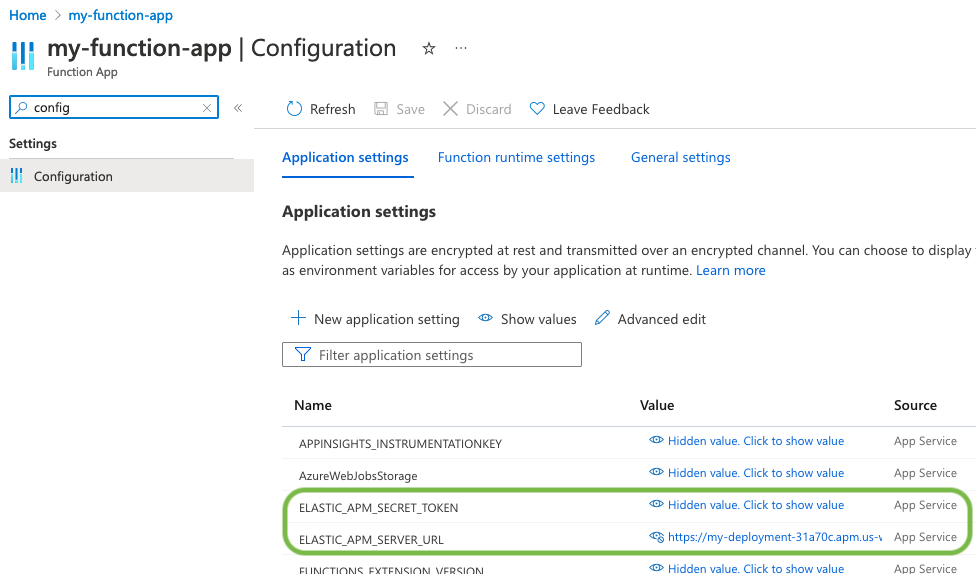

---
mapped_pages:
  - https://www.elastic.co/guide/en/apm/agent/nodejs/current/azure-functions.html
applies_to:
  stack:
  serverless:
    observability:
  product:
    apm_agent_node: ga
products:
  - id: cloud-serverless
  - id: observability
  - id: apm
---

# Monitoring Node.js Azure Functions [azure-functions]

The Node.js APM Agent can trace function invocations in an [Azure Functions](https://learn.microsoft.com/en-us/azure/azure-functions/) app, using either v3 or [v4 of the Node.js programming model](https://learn.microsoft.com/en-us/azure/azure-functions/functions-node-upgrade-v4).


## Prerequisites [azure-functions-prerequisites]

You need an APM Server to send APM data to. Follow the [APM Quick start](docs-content://solutions/observability/apm/get-started.md) if you have not set one up yet. You will need your **APM server URL** and an APM server **secret token** (or **API key**) for configuring the APM agent below.

You will also need an Azure Function app to monitor. If you do not have an existing one, you can follow [this Azure guide](https://learn.microsoft.com/en-us/azure/azure-functions/create-first-function-cli-node#create-supporting-azure-resources-for-your-function) to create one.

::::{important}
If you use `func init --javascript ...` as suggested in this Azure guide, then it is recommended that you **uninstall** the `azure-functions-core-tools` dependency by running `npm uninstall azure-functions-core-tools` and [install it separately](https://github.com/Azure/azure-functions-core-tools#installing). Having `azure-functions-core-tools` as a "devDependency" in your package.json will result in unreasonably large deployments that will be very slow to publish and will run your Azure Function app VM out of disk space.

::::


You can also take a look at and use this [Azure Functions example app with Elastic APM already integrated](https://github.com/elastic/apm-agent-nodejs/tree/main/examples/azure-function-app/).


## Step 1: Add the APM agent dependency [azure-functions-setup]

Add the `elastic-apm-node` module as a dependency of your application:

```bash
npm install elastic-apm-node --save  # or 'yarn add elastic-apm-node'
```


## Step 2: Start the APM agent [_step_2_start_the_apm_agent]

For the APM agent to instrument Azure Functions, it needs to be started when the Azure host starts its Node.js worker processes. The best way to do so is by using an app-level entry point (support for this was added for Node.js Azure Functions [here](https://github.com/Azure/azure-functions-nodejs-worker/issues/537)).

1. Create a module to start the APM agent. For example, a file at the root of your repository named "initapm.js":

    ```javascript
    // initapm.js
    require('elastic-apm-node').start({
      // Add configuration options here
    })
    ```

    Optional [configuration options](/reference/configuration.md) can be added on start.

2. Change the "main" entry in your "package.json" to point to the initapm.js file.

    ```json
    ...
      "main": "{initapm.js,src/functions/*.js}",
    ...
    ```


## Step 3: Configure the APM agent [_step_3_configure_the_apm_agent]

The APM agent can be [configured](/reference/configuring-agent.md) with options to the `.start()` method or with environment variables. Using environment variables allows one to use [application settings in the Azure Portal](https://learn.microsoft.com/en-us/azure/azure-functions/functions-how-to-use-azure-function-app-settings?tabs=portal#settings) which allows hiding values and updating settings without needing to re-deploy code.

Open *Configuration > Application settings* for your Function App in the Azure Portal and set:

```yaml
ELASTIC_APM_SERVER_URL: <your APM server URL from the prerequisites step>
ELASTIC_APM_SECRET_TOKEN: <your APM secret token from the prerequisites step>
```

For example:



For local testing via `func start`, you can set these environment variables in your terminal, or in the "local.settings.json" file. See the [agent configuration guide](/reference/configuration.md) for full details on supported configuration variables.


## Step 4: (Re-)deploy your Azure Function app [_step_4_re_deploy_your_azure_function_app]

```bash
func azure functionapp publish <APP_NAME>
```

Now, when you invoke your Azure Functions, you should see your application show up as a Service in the APM app in Kibana and see APM transactions for function invocations.  Tracing data is forwarded to APM server after a period of time, so allow a minute or so for data to appear.


## Limitations [azure-functions-limitations]

Distributed tracing for incoming HTTP requests to Azure Functions (using v4 of the programming model) does **not** work, because of a issue with Azure’s handling of trace-context. See [this](https://github.com/elastic/apm-agent-nodejs/pull/4426#issuecomment-2596922653) for details.

Azure Functions instrumentation currently does *not* collect system metrics in the background because of a concern with unintentionally increasing Azure Functions costs (for Consumption plans).

Elastic APM’s [central configuration](/reference/configuration.md#central-config) is not supported for Azure Functions.


## Filter sensitive information [azure-functions-filter-sensitive-information]

By default, the Node.js agent will filter common sensitive information before sending errors and metrics to the Elastic APM server.

It’s possible for you to tweak these defaults or remove any information you don’t want to send to Elastic APM:

* By default, the Node.js agent will not log the body of HTTP requests. To enable this, use the [`captureBody`](/reference/configuration.md#capture-body) config option
* By default, the Node.js agent will filter certain HTTP headers known to contain sensitive information. To disable this, use the [`sanitizeFieldNames`](/reference/configuration.md#sanitize-field-names) config option
* To apply custom filters, use one of the [filtering](/reference/agent-api.md#apm-add-filter) functions


## Compatibility [azure-functions-compatibility]

See [*Supported technologies*](/reference/supported-technologies.md) for details.


## Troubleshooting [azure-functions-troubleshooting]

If you can’t get the Node.js agent to work as expected, please follow the [troubleshooting guide](docs-content://troubleshoot/observability/apm-agent-nodejs/apm-nodejs-agent.md).

