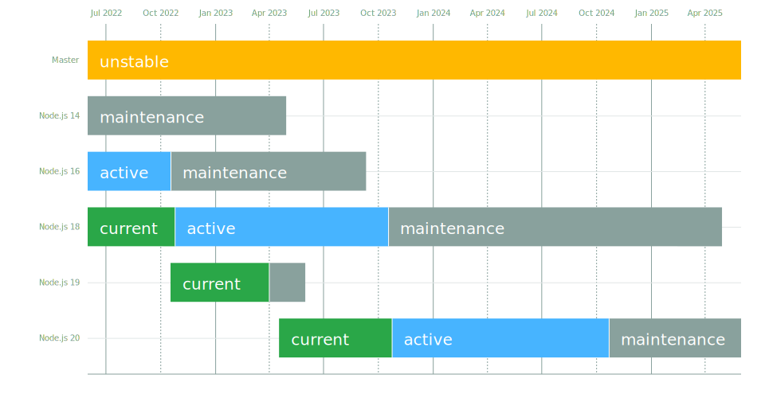

---
mapped_pages:
  - https://www.elastic.co/guide/en/apm/agent/nodejs/current/supported-technologies.html
applies_to:
  stack:
  serverless:
    observability:
  product:
    apm_agent_node: ga
---

# Supported technologies [supported-technologies]

The Elastic APM Node.js Agent automatically instruments various APIs in Node.js core and third-party frameworks and packages. This page lists all supported technologies and version ranges.

## Node.js versions [compatibility-node]

Support for the Elastic APM Node.js agent follows the [support schedule of Node.js itself](https://nodejs.org/en/about/releases/) to the end-of-life period of each version after its maintenance term. Versions of Node.js past their end-of-life date are not supported.

APM agent 4.x releases work with Node.js versions 14.17.0 and later. APM agent 3.x maintenance releases work with Node.js versions 8.6 and later. We will only break support for older Node.js versions with a major version release of the APM agent.

## ECMAScript Modules (ESM) [compatibility-esm]

Beginning with version v3.48.0, the Elastic APM Node.js agent includes *limited and experimental* support for instrumenting [ECMAScript module imports](https://nodejs.org/api/esm.html#modules-ecmascript-modules), i.e. modules that are loaded via `import ...` statements and `import('...')` (dynamic import). See the [*ECMAScript module support*](/reference/esm.md) document for details.

Note: If you are using TypeScript or JavaScript that is *compiled/translated/transpiled to CommonJS-using JavaScript* via tools like Babel, Webpack, esbuild, etc., then using `import ...` in your source code is fine. To ensure your compiler is generating JS that uses CommonJS imports, use the following settings:

* For TypeScript, use [`"module": "commonjs"` in your "tsconfig.json"](https://www.typescriptlang.org/tsconfig#module) (a [complete tsconfig.json example](https://github.com/tsconfig/bases/blob/main/bases/node16.json)).
* For Babel, use [`"modules": "commonjs"` in your Babel config](https://babeljs.io/docs/en/babel-preset-env#modules) ([for example](https://github.com/elastic/apm-agent-nodejs/blob/main/test/babel/.babelrc)).
* For Webpack, use `target: 'node', externalsPresets: { node: true }` in your "webpack.config.js".
* For esbuild, use `--platform=node --target=node...` options to `esbuild` ([for example](https://github.com/elastic/apm-agent-nodejs/blob/main/examples/esbuild/package.json#L7)).

## Elastic Stack Compatibility [elastic-stack-compatibility]

This agent is compatible with [APM Server](docs-content://solutions/observability/apm/index.md) v6.6 and above.

## Frameworks [compatibility-frameworks]

Though you can use Elastic APM [with any Node.js framework](/reference/custom-stack.md), we automate a few things for the most popular Node.js modules. These are the frameworks that we officially support:

| Framework | Version | Note |
| --- | --- | --- |
| [AWS Lambda](/reference/lambda.md) | N/A |  |
| [Azure Functions](/reference/azure-functions.md) | v3, v4 | [Node.js programming model v3 and v4](https://learn.microsoft.com/en-us/azure/azure-functions/functions-node-upgrade-v4) |
| [Express](/reference/express.md) | >=4.0.0 <6.0.0 |  |
| [Fastify](/reference/fastify.md) | >=1.0.0 | See also [Fastify’s own LTS documentation](https://www.fastify.io/docs/latest/Reference/LTS/) |
| [@hapi/hapi](/reference/hapi.md) | >=17.9.0 <22.0.0 |  |
| [Koa](/reference/koa.md) via koa-router or @koa/router | >=5.2.0 <14.0.0 | Koa doesn’t have a built in router, so we can’t support Koa directly since we rely on router information for full support. We currently support the most popular Koa router called [koa-router](https://github.com/koajs/koa-router). |
| [Restify](/reference/restify.md) | >=5.2.0 <12.0.0 |  |

## OpenTelemetry [compatibility-opentelemetry]

The Node.js Elastic APM agent supports usage of the OpenTelemetry Tracing API via its [*OpenTelemetry bridge*](/reference/opentelemetry-bridge.md). As well, it instruments the OpenTelemetry Metrics API and Metrics SDK to allow [usage of the OpenTelemetry Metrics API](/reference/opentelemetry-bridge.md#otel-metrics-api).

| Framework | Version |
| --- | --- |
| [@opentelemetry/api](/reference/opentelemetry-bridge.md) | >=1.0.0 <1.10.0 |
| [@opentelemetry/sdk-metrics](https://www.npmjs.com/package/@opentelemetry/sdk-metrics) | >=1.11.0 <2 |

## Custom Transactions [compatibility-custom-transactions]

By default transactions are named based on their matched HTTP route if the framework used is listed above. These modules override that behavior to give better insights into specialized HTTP servers:

| Module | Version | Note |
| --- | --- | --- |
| [express-graphql](https://www.npmjs.com/package/express-graphql) | >=0.6.1 <0.13.0 | Will name all transactions by the GraphQL query name. There is a [known issue with node <10.4](https://github.com/elastic/apm-agent-nodejs/issues/2516). This module is deprecated and is no longer tested. |
| [apollo-server-express](https://www.npmjs.com/package/apollo-server-express) | >=2.0.4 <4 | Will name all transactions by the GraphQL query name. Versions before 2.9.6 are no longer tested. |
| [@apollo/server](https://www.npmjs.com/package/@apollo/server) | >=4.0.0 | Will name all transactions by the GraphQL query name |

## Tracing and Instrumentation [compatibility-tracing-and-instrumentation]

The Node.js agent will automatically instrument the following modules to give you detailed performance metrics:

| Module | Version | Note |
| --- | --- | --- |
| [aws-sdk](https://www.npmjs.com/package/aws-sdk) | >=2.858.0 <3 | Will instrument SQS send/receive/delete messages, all S3 methods, all DynamoDB methods, and the SNS publish method |
| [@aws-sdk/client-s3](https://www.npmjs.com/package/@aws-sdk/client-s3) | >=3.15.0 <4 | Will instrument all S3 methods |
| [@aws-sdk/client-sns](https://www.npmjs.com/package/@aws-sdk/client-s3) | >=3.15.0 <4 | Will instrument the SNS publish method |
| [@aws-sdk/client-sqs](https://www.npmjs.com/package/@aws-sdk/client-s3) | >=3.15.0 <4 | Will instrument SQS send/receive/delete messages |
| [@aws-sdk/client-dynamodb](https://www.npmjs.com/package/@aws-sdk/client-dynamodb) | >=3.15.0 <4 | Will instrument all DynamoDB methods |
| [cassandra-driver](https://www.npmjs.com/package/cassandra-driver) | >=3.0.0 <5 | Will instrument all queries |
| [elasticsearch](https://www.npmjs.com/package/elasticsearch) | >=8.0.0 | Will instrument all queries |
| [@elastic/elasticsearch](https://www.npmjs.com/package/@elastic/elasticsearch) | >=7.0.0 <9.0.0 | Will instrument all queries |
| [graphql](https://www.npmjs.com/package/graphql) | >=0.7.0 <17 | Will instrument all queries |
| [handlebars](https://www.npmjs.com/package/handlebars) | * | Will instrument compile and render calls |
| [jade](https://www.npmjs.com/package/jade) | >=0.5.6 | Will instrument compile and render calls; Deprecated. No longer tested. Use pug. |
| [pug](https://www.npmjs.com/package/pug) | >=0.1.0 | Will instrument compile and render calls |
| [ioredis](https://www.npmjs.com/package/ioredis) | >=2.0.0 <6.0.0 | Will instrument all queries |
| [memcached](https://www.npmjs.com/package/memcached) | >=2.2.0 | Will instrument all commands. |
| [mongodb-core](https://www.npmjs.com/package/mongodb-core) | >=1.2.19 <4 | Will instrument all queries.A lot of higher level MongoDB modules use mongodb-core,so those should be supported as well. |
| [mongodb](https://www.npmjs.com/package/mongodb) | >=2.0.0 <3.3.0 | Supported via mongodb-core |
| [mongodb](https://www.npmjs.com/package/mongodb) | >=3.3.0 <7 | Will instrument all queries |
| [mongojs](https://www.npmjs.com/package/mongojs) | >=1.0.0 <2.7.0 | Supported via mongodb-core |
| [mongoose](https://www.npmjs.com/package/mongoose) | >=4.0.0 <5.7.0 | Supported via mongodb-core |
| [mongoose](https://www.npmjs.com/package/mongoose) | >=5.7.0 <8 | Supported via mongodb |
| [mysql](https://www.npmjs.com/package/mysql) | ^2.0.0 | Will instrument all queries |
| [mysql2](https://www.npmjs.com/package/mysql2) | >=1.0.0 <4.0.0 | Will instrument all queries |
| [pg](https://www.npmjs.com/package/pg) | >=4.0.0 <9.0.0 | Will instrument all queries |
| [redis](https://www.npmjs.com/package/redis) | >=2.0.0 <5.0.0 | Will instrument all queries |
| [tedious](https://www.npmjs.com/package/tedious) | >=1.9 <20.0.0 | (Excluding v4.0.0.) Will instrument all queries |
| [undici](https://www.npmjs.com/package/undici) | >=4.7.1 <8 | Will instrument undici HTTP requests, except HTTP CONNECT. Requires node v14.17.0 or later, or the user to have installed the [*diagnostics_channel* polyfill](https://www.npmjs.com/package/diagnostics_channel). |
| [ws](https://www.npmjs.com/package/ws) | >=1.0.0 <8.0.0 | Will instrument outgoing WebSocket messages |
| [kafkajs](https://www.npmjs.com/package/kafkajs) | >=2.0.0 <3.0.0 | Will instrument all send methods for producers and message and batch processing for consumers. |

## Better Stack Traces [compatibility-better-stack-traces]

The APM agent [can be configured](/reference/configuration.md#span-stack-trace-min-duration) to capture span stack traces, to show where in your code a span (e.g. for a database query) was initiated.

Given the async nature of Node.js, it’s not possible for the APM agent to see further back than the last async boundary. Modules that happen to have an async boundary between a call from your application code and the action that leads to an APM span will limit the utility of these span stack traces.

The modules listed below are those that the APM agent instruments to provide more useful span stack traces — ones that point to your application code — when enabled.

If you don’t see your own code in spans, please create a new topic in the [Elastic APM discuss forum](https://discuss.elastic.co/c/apm) and include information about your dependencies.

| Module | Version | Note |
| --- | --- | --- |
| [knex](https://www.npmjs.com/package/knex) | >=0.10.0 <4.0.0 | Provides better span stack traces for *pg* and *mysql* spans. |

## Continuity [compatibility-continuity]

The Elastic APM agent monitors async operations in your Node.js application to maintain awareness of which request is the active request at any given time. Certain modules can interfere with this monitoring if not handled properly.

Below is a list of modules known to cause issues with this monitoring. The versions listed are the versions we support. If you use an unsupported version you might experience missing spans. This does not impact the stability of your application in any way - only the collected metrics.

If you do experience missing spans in your performance metrics, please create a new topic in the [Elastic APM discuss forum](https://discuss.elastic.co/c/apm) and include information about your dependencies and what data is missing.

| Module | Version | Note |
| --- | --- | --- |
| [bluebird](https://www.npmjs.com/package/bluebird) | >=2.0.0 <4.0.0 |  |
| [generic-pool](https://www.npmjs.com/package/generic-pool) | ^2.0.0 &#124;&#124; ^3.1.0 | Usedby a lot of database modules like for instance "pg" |
| [express-queue](https://www.npmjs.com/package/express-queue) | >=0.0.11 <1.0.0 |  |

