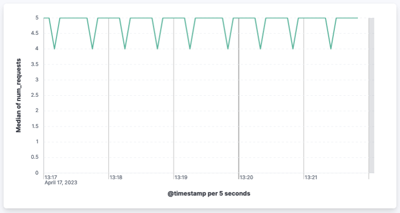

This directory shows how you can use the OpenTelemetry Metrics API with the Elastic APM Node.js agent.

1. You will need an Elastic deployment to which to send APM data.
   If you don't have one, start here to use a free hosted trial:
   https://www.elastic.co/guide/en/apm/guide/current/apm-quick-start.html

2. Install dependencies (XXX bump elastic-apm-node dep once have release):

    ```
    git clone https://github.com/elastic/apm-agent-nodejs.git
    cd apm-agent-nodejs/examples/opentelemetry-metrics
    npm install
    ```

3. Run [the "Hello World" example](./otel-metrics-hello-world.js). This shows
   a minimal example using the `@opentelemetry/api` to create a custom counter
   metric.

    ```
    export ELASTIC_APM_SERVER_URL=https://...  # your Elastic APM Server URL
    export ELASTIC_APM_SECRET_TOKEN=...
    node -r elastic-apm-node/start.js otel-metrics-hello-world.js
    ```

    Then add some load to exercise the custom metrics in that script:

    ```
    while true; do curl http://127.0.0.1:3000/; sleep 1; done
    ```

    **The `num_requests` custom metric counter can now be visualized in Kibana.**

    

5. Stop the hello world example and run [the "Using the OTel Metrics SDK" example](./use-otel-metrics-sdk.js).
   This example shows how to use the OpenTelemetry Metrics *SDK* to export metrics
   both via a Prometheus endpoint *and* to Elastic APM:

    ```
    export ELASTIC_APM_SERVER_URL=https://...  # your Elastic APM Server URL
    export ELASTIC_APM_SECRET_TOKEN=...
    node -r elastic-apm-node/start.js use-otel-metrics-sdk.js
    ```

    Again apply some load to exercise the the script:

    ```
    while true; do curl http://127.0.0.1:3000/; sleep 1; done
    ```

    **The a percentile of the `latency` custom histogram metric can now be visualized in Kibana.**


See https://www.elastic.co/guide/en/apm/agent/nodejs/current/opentelemetry-bridge.html
for more details on the OpenTelemetry integration in the Elastic APM Node.js agent.
